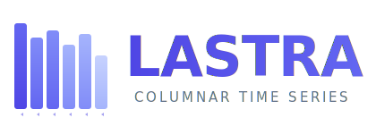

<p align="center">
  
</p>

<p align="center">
  <a href="https://github.com/QTSurfer/lastra-py/actions/workflows/ci.yml"></a>
  <a href="https://pypi.org/project/lastra/"></a>
  <a href="LICENSE"></a>
</p>

<p align="center">
  Python reader/writer for the <a href="https://github.com/QTSurfer/lastra-java">Lastra</a> columnar time series format.<br>
  Bit-exact compatibility with <a href="https://github.com/QTSurfer/lastra-java">lastra-java</a> and <a href="https://github.com/QTSurfer/lastra-ts">lastra-ts</a>.
</p>

---

## Status

🚧 **Pre-release** — repository scaffold while we port the format from Java. The first published release will be `0.8.0` to align with `lastra-java`.

The wire-format spec lives in [FORMAT.md](FORMAT.md). Same semantics as `lastra-java` v0.8.0.

## Install (planned)

```bash
pip install lastra
```

## Usage (planned API)

```python
from lastra import LastraReader

with open("ohlcv.lastra", "rb") as f:
    r = LastraReader(f)

    # Read only what you need — other columns are not decompressed
    ts = r.read_series("ts")           # numpy int64 array
    close = r.read_series("close")     # numpy float64 array

    # Column metadata
    meta = r.series_column("ema1").metadata
    # {"indicator": "ema", "periods": "10"}

    # Events (independent timestamps)
    sig_ts = r.read_event("ts")
    sig_data = r.read_event("data")    # list[bytes]
```

Pandas / Polars / Arrow adapters (planned for 0.9):

```python
df = LastraReader(f).to_pandas()      # all series columns
pl_df = LastraReader(f).to_polars()
table = LastraReader(f).to_arrow()
```

## Why Lastra

Lastra is a columnar file format optimised for **numeric time series** —
financial tick data, IoT sensors, infrastructure metrics. It applies
**semantic compression** per column:

- **ALP**: decimal-aware → ~3-4 bits/value for prices at 2 decimal places
- **Pongo**: decimal erasure + Gorilla XOR → ~18 bits/value
- **Gorilla**: XOR for volatile metrics
- **DELTA_VARINT**: ~1 byte/value for regular timestamps

A typical OHLCV column at 2 decimal places compresses to ~13× the raw
size — about 2× better than Apache Parquet (SNAPPY) or ORC for the same
data. See the [lastra-java README](https://github.com/QTSurfer/lastra-java)
for benchmarks.

## Reference implementations

| Language | Repo | Status |
|----------|------|--------|
| Java | [QTSurfer/lastra-java](https://github.com/QTSurfer/lastra-java) | Reference (writer + reader) |
| TypeScript | [QTSurfer/lastra-ts](https://github.com/QTSurfer/lastra-ts) | Reader feature-complete |
| Python | [QTSurfer/lastra-py](https://github.com/QTSurfer/lastra-py) | This repo |

## Conversion to/from Parquet, CSV, Arrow

See [QTSurfer/lastra-convert-py](https://github.com/QTSurfer/lastra-convert-py) — Python CLI port of the [QTSurfer/lastra-convert](https://github.com/QTSurfer/lastra-convert) (Java) tool.

## License

Copyright 2026 Wualabs LTD. Apache License 2.0 — see [LICENSE](LICENSE).
